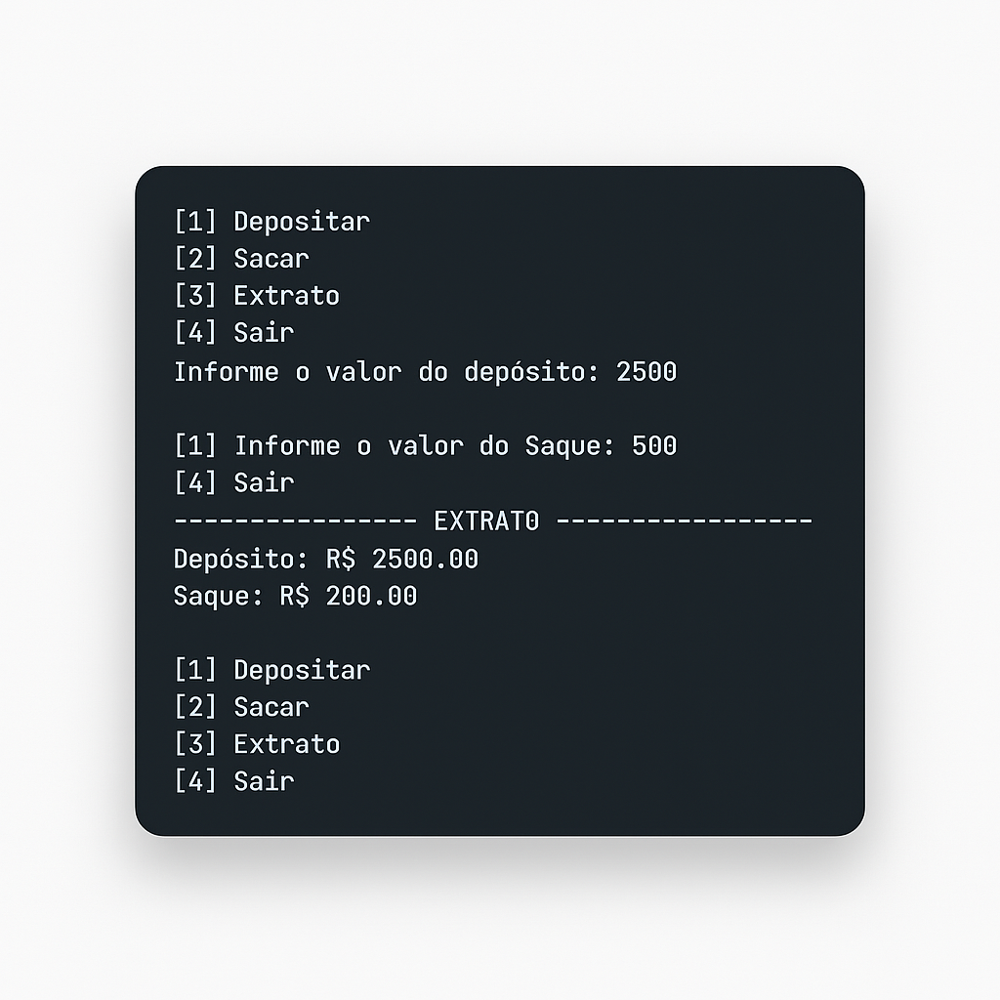

# Banco Simples em Python 🏦

Um projeto de terminal feito em Python que simula operações bancárias simples como depósito, saque e visualização de extrato.

## Funcionalidades 🚀

- 💸 Depósito de valores
- 🏧 Saque de valores
- 📄 Exibição de extrato com saldo
- 🔐 Verificação simples de saldo para saques

## Tecnologias utilizadas

- Python 3

## Demonstração



---

## Como executar 📥

1. Clone o repositório:
   ```bash
   git clone https://github.com/KarolNutty/banco-simples-python.git


Feito com 💙 por [Karoline](https://github.com/KarolNutty)

---

